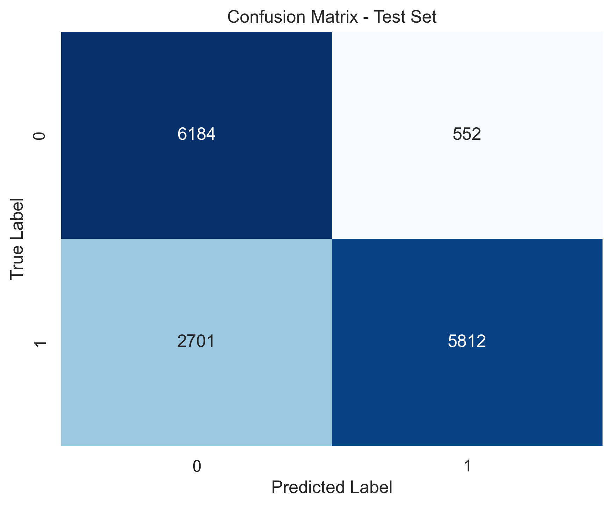
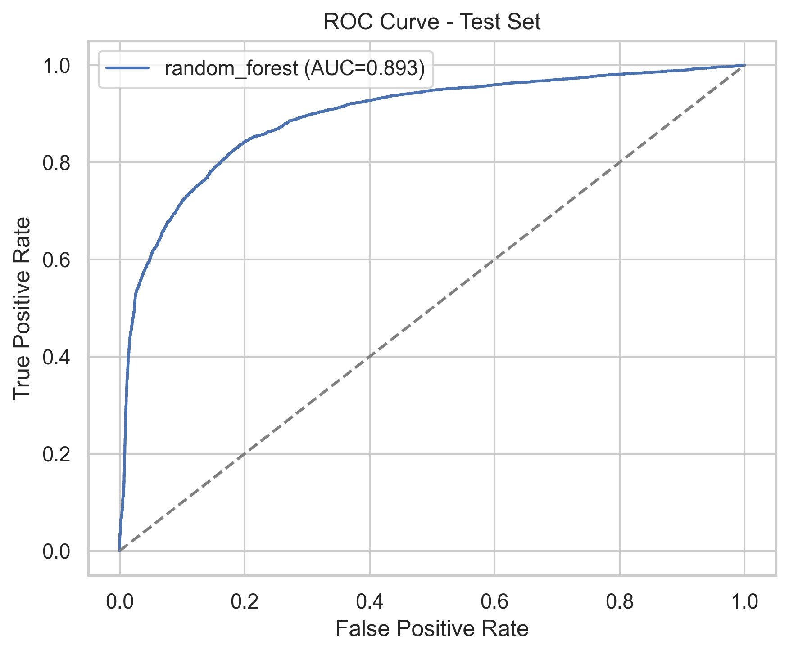
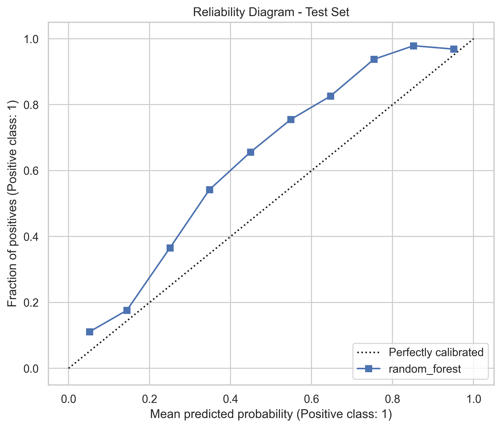
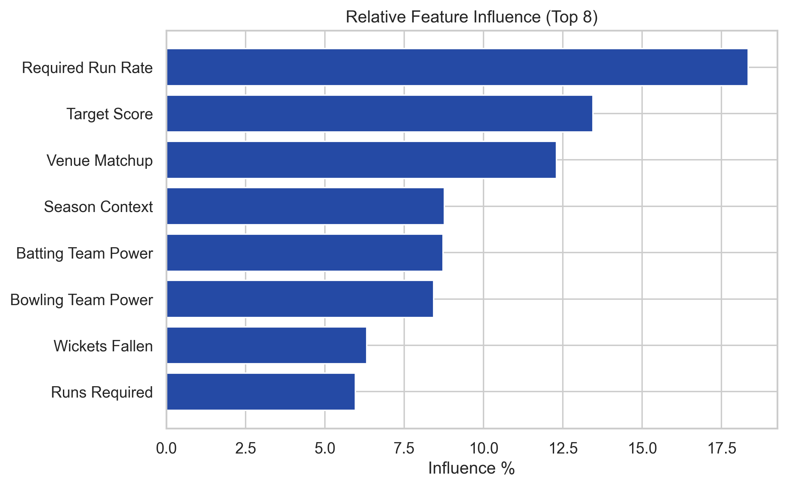
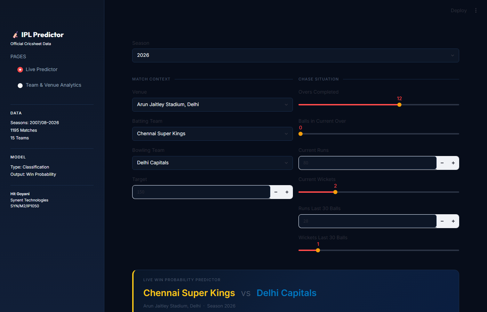
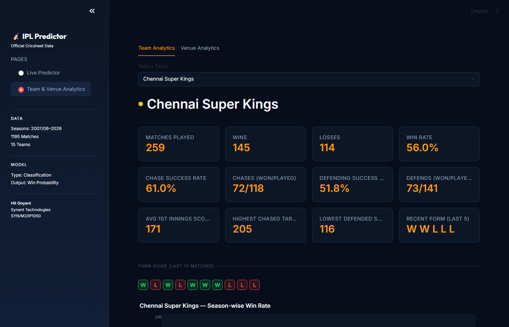

# Task 9 - IPL Live Win Probability Predictor

**Synent Technologies Data Science Internship | Candidate ID: SYN/M2/IP1050**

[](#)
[](#)
[](#)
[](#)

---

## Overview

This project predicts the probability of the chasing team winning an IPL match during the second innings using official Cricsheet IPL ball-by-ball data. The workflow is designed for correctness, reproducibility, and interview defensibility.

---

## Problem Statement

Given a live second-innings chase state, estimate the probability that the batting side will win the match. The project uses only standard IPL matches with clear winners and excludes DLS, no-result, abandoned, tied, and super-over outcomes.

---

## Dataset Description

| Detail | Info |
|--------|------|
| Canonical Source | Cricsheet IPL JSON |
| Download | [ipl_json.zip](https://cricsheet.org/downloads/ipl_json.zip) |
| Working Format | Flattened preprocessing table derived from JSON |
| Coverage | Dynamically discovered from the downloaded files |
| Match Granularity | Ball-by-ball |
| Target | `1 = chasing team eventually won`, `0 = chasing team eventually lost` |

Cricsheet JSON is the canonical source of truth. Any flattened table in the repository is a preprocessing artifact only.

---

## Data Cleaning

- Normalize team names and venue names.
- Exclude DLS, no-result, abandoned, tied-without-winner, and super-over matches.
- Compute first innings total and set `target = first_innings_total + 1`.
- Keep only second-innings legal deliveries.
- Treat wides and no-balls as runs that do not increment ball count.
- Remove post-victory deliveries.

---

## Feature Engineering

### Match Context

- Season
- Venue
- Batting Team
- Bowling Team
- Target

### Match State

- Current Runs
- Current Wickets
- Balls Completed
- Balls Remaining
- Runs Required

### Rate Features

- Current Run Rate
- Required Run Rate

### Momentum Features

- Runs Last 30 Legal Deliveries
- Wickets Last 30 Legal Deliveries

---

## Model Comparison

Two models are trained:

1. Logistic Regression
2. Random Forest Classifier

The final model is selected based on validation ROC-AUC performance.

---

## Evaluation

Reported metrics:

- Accuracy
- Precision
- Recall
- F1 Score
- ROC-AUC
- Brier Score (probability calibration quality — lower is better)

Diagnostics:

- Confusion Matrix
- ROC Curve
- Reliability Diagram (calibration plot)

Calibration is conditional and only applied if the reliability diagram shows it is needed.

---

## Streamlit App

The app has exactly two pages:

### Page 1 - Live Win Predictor

Inputs:

- Season
- Venue
- Batting Team
- Bowling Team
- Target
- Current Runs
- Current Wickets
- Overs and Balls
- Runs Last 30 Balls
- Wickets Last 30 Balls

Outputs:

- Batting Team Win Probability
- Bowling Team Win Probability

Strict validation rejects impossible chase states before prediction.

### Page 2 - Team & Venue Analytics

Displays:

- Matches Played
- Wins / Losses / Win Percentage
- Chase Success Rate
- Defending Success Rate
- Highest Chased Target / Lowest Defended Score
- Recent Form (Last 5 and Last 10 matches)
- Season-wise Win Rate Chart
- Easiest & Hardest Opponents
- Venue Performance Summary
- Match History by Season

---

## Repository Structure

```
Task9-IPLScorePredictor/
├── data/
│   ├── chase_dataset.parquet
│   ├── ipl_json.zip
│   └── ipl_live_win_predictor_dataset.csv   ← generated by notebook (gitignored)
├── images/
│   ├── confusion_matrix.png
│   ├── roc_curve.png
│   ├── reliability_diagram.png
│   ├── reliability_diagram_val.png
│   ├── feature_importance.png
│   ├── streamlit_predictor.png
│   └── streamlit_team_analytics.png
├── model/
│   ├── model.pkl                             ← generated by notebook (gitignored)
│   ├── model_metrics.html
│   ├── model_metrics.csv
│   ├── task9_artifact_summary.json
│   └── train_val_test_split.json
├── notebook/
│   └── ipl_live_win_predictor.ipynb
├── app.py
├── README.md
├── Task9_Report.pdf
├── requirements.txt
├── run_app.bat
└── .gitignore
```

> **Note:** `model/model.pkl` (≈257 MB) and generated data files are gitignored.
> Run the notebook from Phase 1 to Phase 12 to regenerate all artifacts before launching the app.

---

## How to Run

```bash
pip install -r requirements.txt
playwright install chromium
```

Run the notebook first (all cells, Phase 1–12) to build the dataset and save the pipeline artifact, then launch the app:

### Method 1: Double-click the Shortcut (Windows)
Double-click **`run_app.bat`** in the task folder root. This requires the shared `.venv` at `SYNENT_Internship_Template/.venv/`.

### Method 2: Command Line
```bash
streamlit run app.py
```

---

## Visual Reports & Verification

### Model Evaluation Figures
The following figures are saved automatically under `images/` during model training:

| Confusion Matrix | ROC Curve |
| :---: | :---: |
|  |  |

| Reliability Diagram | Feature Influence |
| :---: | :---: |
|  |  |

### Streamlit Dashboard Preview
The dashboard screenshots are captured automatically using Playwright at the end of the pipeline run:

* **Live Chase Predictor Tab**:
  

* **Team & Venue Analytics Tab**:
  

---

## Limitations

- The dataset excludes abnormal match outcomes by design.
- Team and venue normalization may need small updates if Cricsheet introduces new naming variants.
- Calibration is only applied if validation results justify it.
- `model.pkl` is gitignored due to size (≈257 MB). Regenerate by running the notebook.

---

## Future Improvements

- Add optional calibration if probability reliability is weak.
- Extend reporting with more detailed season-wise summary tables if required later.
- Explore XGBoost or LightGBM as additional candidate models.

---

## Author Information

**Hit Goyani**

B.Tech Information Technology

Synent Technologies Data Science Internship

Candidate ID: SYN/M2/IP1050

---

## Requirements

```
pandas
numpy
matplotlib
seaborn
scikit-learn
streamlit
joblib
plotly
playwright
nest_asyncio
pyarrow
```
